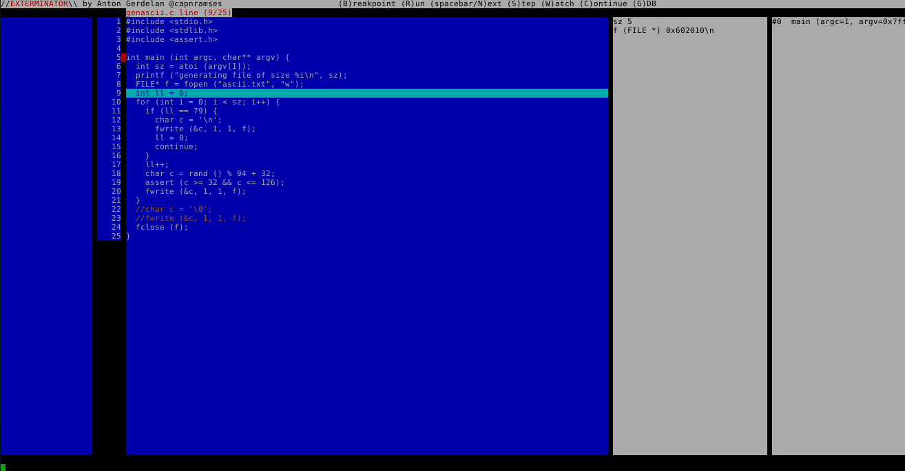

#exterminator

Deadly ex-perimental termin-al debugger (it's an ncurses front-end for GDB).

Because why can't I just have GDB with a better (Turbo-C style) UI and less typing?

##goals

* runs on GNU/Linux
* interactive visual output
* loads immediately, no mess, no fuss
* runs super-fast - instant stepping, quick key commands

##platforms

* GNU/Linux is the target platform
* It accidentally works on OS X because BSD
* MS Windows is not a build target because Windows is a toy for children (it might work)

##status

* most important features working but not robust
* starts a debugging session, loads text of main file, allows visual breakpoints, run, next (step), gdb console, and watch list update
* no file change/browse yet
* temporarily disabled file scrolling
