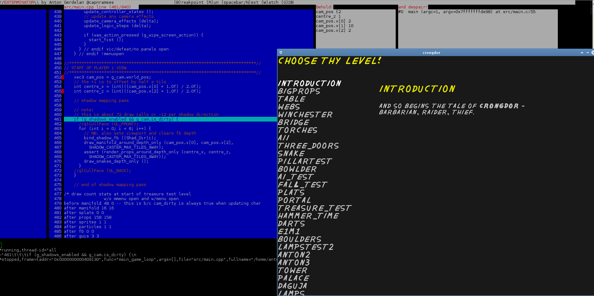

#exterminator

Deadly ex-perimental termin-al debugger (it's an ncurses front-end for GDB). Written in C99.

Because modern IDEs are inexcusably slow, and why can't I just have GDB with a better (Turbo C style) UI and less typing?

##goals

* runs on GNU/Linux
* interactive visual output
* loads immediately, no mess, no fuss
* runs super-fast - instant stepping, quick key commands
* no dependencies or middleware beyond GDB and ncurses

##platforms

* GNU/Linux

##major to-dos

* un-set breakpoints
* goto line button
* source files browser on left hand side bar
* side-by-side asm (later)
* memory inspection window (later)

##status

* most important features working but not robust
* starts a debugging session, loads text of main file, allows visual breakpoints, run, step, step-in, gdb console, watch list, stack trace
* no file browser yet
* string lengths and malloc need sanitation to crash-proof it

##building instructions

`make`

##basic usage

* maximise your terminal window and/or reduce font size to fit more on display
* launch with: `./exterminator target_prog [targetargs]` 
* source file containing entry point is immediately displayed.
* scroll through lines with cursor keys
* set a break point with `b`. you will see break points displayed in the margin.
* run debug session press `r`
* step to the next line press `spacebar` or `n`
* step into a function with `s`
* add a variable to the watch list with `w`
* type more detailed commands by opening GDB terminal `g`.
* press `ESC` to leave GDB terminal mode
* press `ESC` to quit programme
